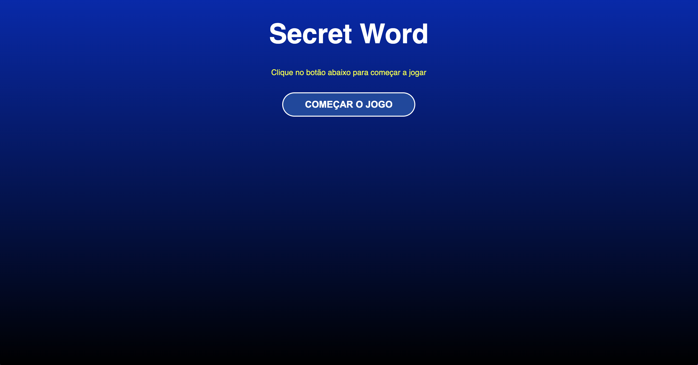
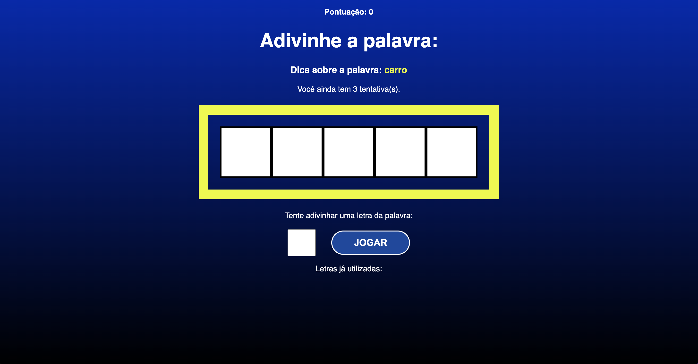
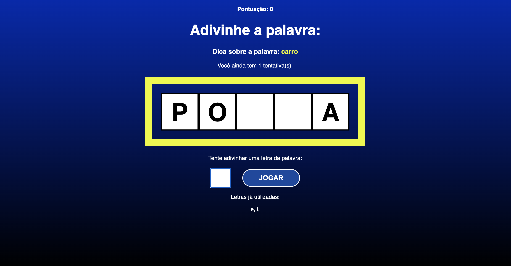
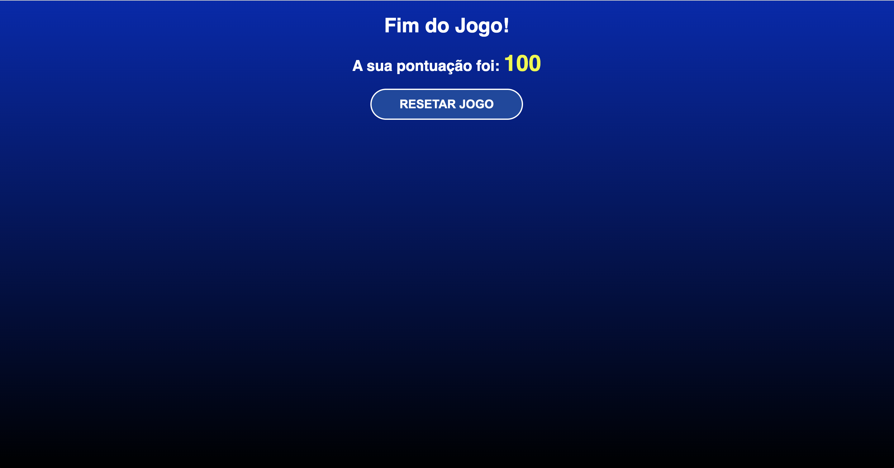

# Palavra Secreta

- O objetivo dessa aplicação é garantir que palavras sejam decifradas em até 3 tentativas.
- A cada letra errada digitada uma tentativa é esgotada.
- Jogo parecido com o famoso Forca.

## Para acessar o projeto:

```
cd secret-word
npm install
npm run dev
```

## Tecnologias e Ferramentas Utilizadas:

- React
- Vite

## Layout da Aplicação






# React + Vite

This template provides a minimal setup to get React working in Vite with HMR and some ESLint rules.

Currently, two official plugins are available:

- [@vitejs/plugin-react](https://github.com/vitejs/vite-plugin-react/blob/main/packages/plugin-react/README.md) uses [Babel](https://babeljs.io/) for Fast Refresh
- [@vitejs/plugin-react-swc](https://github.com/vitejs/vite-plugin-react-swc) uses [SWC](https://swc.rs/) for Fast Refresh
